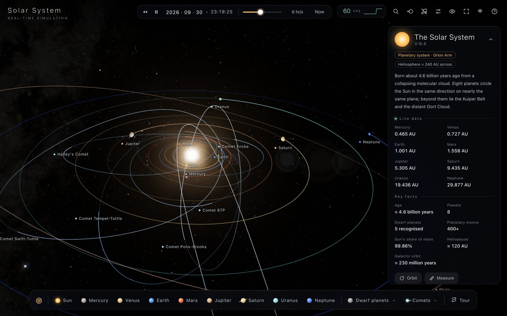
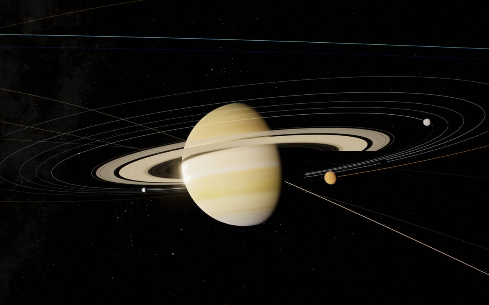
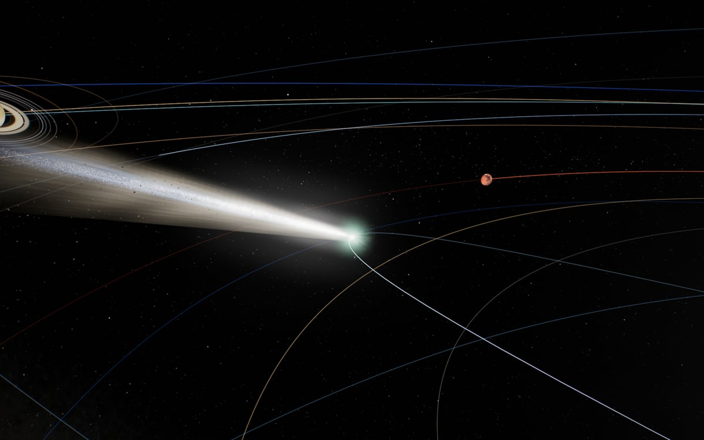
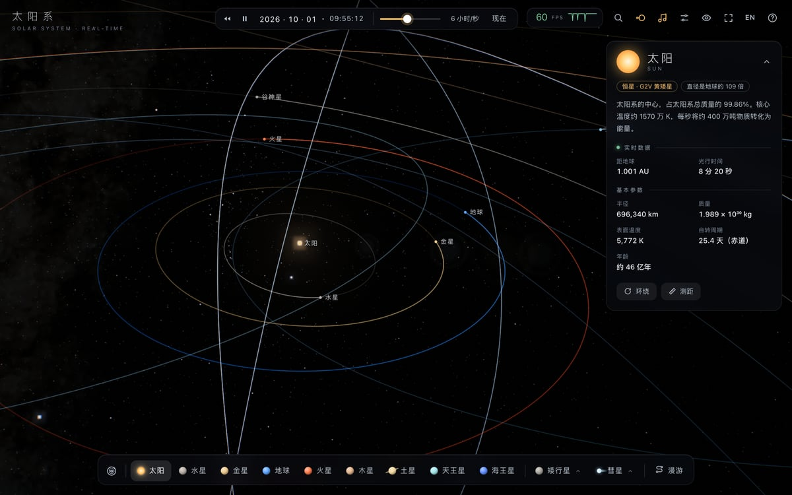

# Solar System · Real-time Simulation

[简体中文](README.md) | English

**Live demo: <https://anrlm.github.io/solar-system/>**

A cinematic, real-time Solar System in your browser. Positions come from real orbital elements; lighting, eclipses and comet tails follow the physics; the soundtrack is synthesised live. The whole thing is a single ~11 MB HTML file that also works offline.



| Saturn and its moons | Halley's Comet in 1986 | The inner Solar System at true scale |
| :---: | :---: | :---: |
|  |  |  |

## Features

### A real sky
- **39 bodies**: the Sun, eight planets, 21 moons, Ceres and Pluto, and seven famous comets including Halley and Hale-Bopp.
- **Driven by real data**:
  - Planets use JPL approximate orbital elements; dwarf planets and comets use elements from the JPL Small-Body Database; the Moon uses Meeus' analytical ephemeris.
  - Rotation and poles follow the IAU model, including the precession of Triton's pole.
  - Time runs from AD 1000 to 2999, can go backwards, and at any rate from real time to one year per second.
- **Eclipses**: umbra and penumbra are computed at true scale. The Moon turns copper-red during a lunar eclipse, and the Moon's shadow crosses the Earth during a solar eclipse. The events list jumps straight to the 2026 and 2027 total solar eclipses, or Halley's return in 2061.
- **Comets**: tails grow as a comet nears the Sun. The blue ion tail points away from the Sun, with rays and streaming plasma knots; the yellow-white dust tail curves along the orbit, surrounded by drifting dust grains. Jets fan out on the sunward side of the coma.
- **The sky**: the Milky Way is NASA SVS's Deep Star Maps 2020 all-sky map (8K). The stars are about 40,000 Hipparcos stars down to magnitude 8, coloured by their colour index. Constellation lines can be toggled.

### Visuals
- Planet surfaces: real textures, plus GPU-generated detail, relief and clouds. Also atmospheric scattering, city lights on the night side, and shadows on Saturn's rings.
- Post-processing: god rays, bloom, lens flare, ACES tone mapping and film grain. Exposure drops automatically near the Sun, as a real camera's would.
- Four quality presets with a live frame-rate readout; click the FPS readout for frame time, resolution and draw calls.

### Exploring
- **Overview** and **auto tour**: the tour has 19 stops with cinematic camera moves and captions, and starts by itself after 90 seconds of inactivity.
- **True scale**: switching morphs the whole Solar System over about two seconds, from the display scale (bodies enlarged, distances compressed) to true scale. Planets shrink to specks, so labels are pinned to where they are. Long flights follow a smooth zoom-and-pan path: pull out, pan across, then push in.
- **Search**: find bodies by Chinese or English name, or by type ("moon of Saturn", "comet").
- **Distance tool**: pick any two bodies to see the true distance and light-travel time.
- **Info card**: shows each body's facts and live data (distance from the Sun and Earth, light time, orbital speed).

### And more
- **Adaptive soundtrack**: synthesised live with Web Audio and never the same twice. The key changes with the body in focus, bells grow denser as time speeds up, and the music mutes when the page goes into the background.
- **Chinese / English UI**: follows the browser's language on first visit, and can be switched at any time.
- **Works offline**: open the live page and use "Save As"; the single HTML file you get runs on its own.

## Controls

| Key | Action | Key | Action |
| --- | --- | --- | --- |
| Drag / scroll | Rotate / zoom | Click | Focus a body |
| <kbd>0</kbd>–<kbd>9</kbd> | Switch body | <kbd>O</kbd> | Overview |
| <kbd>Space</kbd> | Pause / resume | <kbd>[</kbd> <kbd>]</kbd> | Change time rate |
| <kbd>R</kbd> | Reverse time | <kbd>T</kbd> | Auto tour (<kbd>←</kbd> <kbd>→</kbd> to change stops) |
| <kbd>/</kbd> or <kbd>⌘K</kbd> | Search | <kbd>D</kbd> | Distance tool |
| <kbd>P</kbd> | True scale | <kbd>C</kbd> | Constellations |
| <kbd>L</kbd> | Chinese / English | <kbd>M</kbd> | Music on / off |
| <kbd>I</kbd> | Collapse info card | <kbd>S</kbd> | Settings |
| <kbd>H</kbd> | Hide UI | <kbd>F</kbd> | Fullscreen |
| <kbd>?</kbd> | All shortcuts | <kbd>Esc</kbd> | Close popovers |

Requires a modern browser with WebGL 2 and `DecompressionStream`: Chrome / Edge 103+, Safari 16.4+ or Firefox 113+. A desktop browser is recommended.

## How it works

- **Single-file build**: [esbuild](https://esbuild.github.io/) bundles the code, and the textures (WebP), star catalogue, coastlines and other data are all inlined into one HTML file as base64.
- **Planet surfaces**: at load time the GPU renders equirectangular textures strip by strip, layering procedural detail over the real maps. They are regenerated when the quality setting changes.
- **Camera-relative rendering**: at true scale, Charon is about 5 billion km from the Sun yet only 606 km in radius, beyond float32 precision. So every frame the camera is moved to the origin and shader positions are computed relative to it. Together with a logarithmic depth buffer, one scene can show Phobos sharply and still hold the Kuiper Belt.
- **Kepler's equation**: comets have eccentricities close to 1, so the solver uses Danby's starting value and iterates to convergence; otherwise it diverges near perihelion.
- **Eclipses**: with enlarged bodies there would be eclipses every month, so shadows are computed separately from true-scale positions and radii.

## Development

```bash
npm install
npm run build        # produces solar-system.html
npm test             # astronomy checks, smoke test, soundtrack, UI flows
```

Tests drive the local Chrome through puppeteer (the path is set in `test/open.mjs`). `test/` also holds a few specialised tools:
- `perf.mjs`: frame rate for each quality preset.
- `prof.mjs`: GPU time profile for each view.
- `same.mjs`: pixel-by-pixel comparison of two builds, to verify that a performance change leaves the image unchanged.
- `flicker.mjs` / `hdr.mjs`: flicker and hot-pixel detection.

The processed textures and Milky Way map are committed in `assets/`. To download and convert them again, run `node tools/fetch-textures.mjs` (this downloads large source files).

Every push to `main` is built and published to GitHub Pages by GitHub Actions.

```
src/
  main.js     engine: orbital mechanics, scene, camera, scale switching, post-processing, main loop
  shaders.js  all shaders
  ui.js       interface: info card, dock, settings, search, distance tool, tour captions
  audio.js    procedural soundtrack
  data.js     body data (Chinese) and tour stops      data-en.js  English data
  i18n.js     Chinese / English switching
build.mjs     build: rasterise coastlines, pack stars and constellations, inline textures
tools/        texture download and conversion
test/         automated tests and profiling tools
```

## Data and assets

- Planet textures © [Solar System Scope](https://www.solarsystemscope.com/textures/), [CC BY 4.0](https://creativecommons.org/licenses/by/4.0/), based on NASA data
- Milky Way: [NASA/Goddard Space Flight Center Scientific Visualization Studio](https://svs.gsfc.nasa.gov/4851), Gaia DR2: ESA/Gaia/DPAC
- Lunar elevation: NASA SVS [CGI Moon Kit](https://svs.gsfc.nasa.gov/4720)
- Stars: Hipparcos catalogue; constellation lines and names: [d3-celestial](https://github.com/ofrohn/d3-celestial)
- Coastlines: Natural Earth (via [world-atlas](https://github.com/topojson/world-atlas))
- Orbital elements: NASA JPL; rendering: [three.js](https://threejs.org/)

## Licence

The code is released under the [MIT](LICENSE) licence. The third-party assets listed above keep their own licences; for example, the planet textures require CC BY 4.0 attribution.
