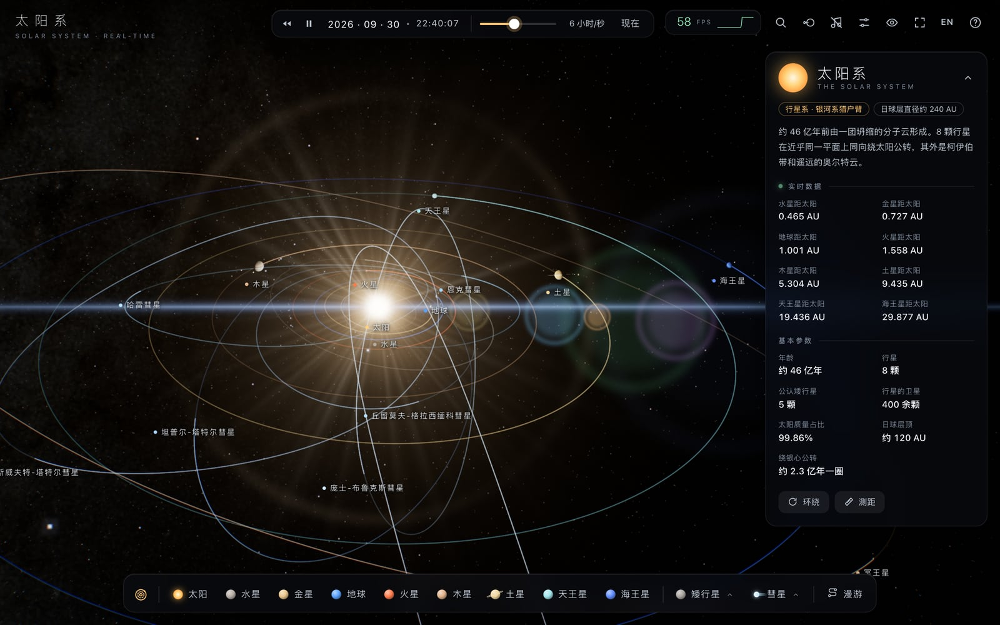

# 太阳系 · 实时模拟

简体中文 | [English](README.en.md)

**在线体验：<https://anrlm.github.io/solar-system/>**

在浏览器里实时运行的电影级太阳系。天体位置按真实轨道根数计算，光影、日月食、彗尾都按物理规律呈现；配乐由浏览器现场合成；整个页面是一个约 13 MB、可离线打开的 HTML 文件。



| 土星与它的卫星 | 1986 年回归的哈雷彗星 | 真实比例下的内太阳系 |
| :---: | :---: | :---: |
|  |  |  |

## 特性

### 真实的天空
- **39 个天体**：太阳、八大行星、21 颗卫星、谷神星与冥王星，以及哈雷、海尔-波普等 7 颗著名彗星。
- **按真实数据运行**：
  - 行星用 JPL 近似轨道根数；矮行星与彗星用 JPL 小天体数据库的根数；月球用 Meeus 解析历表。
  - 自转与极轴用 IAU 模型，海卫一的极轴进动也已考虑。
  - 时间范围为公元 1000–2999 年，可倒流，流速从实时到每秒一年。
- **日月食**：在真实尺度下计算本影与半影。月食时月面会变成红铜色，日食时地面上能看到月影。天象列表里可以一键跳到 2026、2027 年的日全食，以及哈雷彗星 2061 年的回归。
- **彗星**：彗尾随日距生长。蓝色离子尾背向太阳，带有射线与流动的等离子团块；黄白色尘埃尾沿轨道弯曲，外面还铺着尘埃粒子。彗发向阳一侧有喷流。
- **星空**：银河来自 NASA SVS Deep Star Maps 2020 全天图（8K）；恒星为依巴谷星表中到 8 等的约 4 万颗星，颜色按色指数计算。星座连线可开关。

### 画面
- 行星表面：真实贴图，加上 GPU 程序化生成的细节、地形起伏与云层；另有大气散射、夜面城市灯光、土星环的阴影与透光。
- 后期效果：体积光、泛光、镜头光晕、ACES 色调映射、胶片颗粒。靠近太阳时会像真实相机一样自动降低曝光。
- 四档画质预设，帧率实时显示；点帧数可以看帧时间、分辨率、绘制调用等详情。

### 探索
- **全景**与**自动漫游**：漫游共 19 站，配有电影化的镜头运动与字幕；闲置 90 秒后会自动开始。
- **真实比例**：切换时整个太阳系用约 2 秒连续变形，从“放大天体、压缩距离”的展示比例变为真实比例。行星会小到几乎看不见，标签会钉在它们所在的位置上。远距离飞行使用平滑缩放平移路径，先拉远、再平移、最后推近。
- **搜索**：可按中英文名或类型（如“土星的卫星”、“comet”）查找。
- **距离工具**：任选两个天体，显示真实距离与光行时间。
- **信息卡**：显示天体资料与实时数据（日距、地距、光行时间、轨道速度）。

### 其他
- **自适应配乐**：由 Web Audio 实时合成，每次播放都不重复。调性随聚焦的天体变化，时间流速越快钟声越密；页面进入后台时自动静音。
- **中英文界面**：首次访问跟随浏览器语言，之后可随时切换。
- **离线可用**：打开在线页面后“另存为”，得到的单个 HTML 文件就能离线运行。

## 操作

| 按键 | 功能 | 按键 | 功能 |
| --- | --- | --- | --- |
| 拖动 / 滚轮 | 旋转 / 缩放 | 单击 | 聚焦天体 |
| <kbd>0</kbd>–<kbd>9</kbd> | 切换天体 | <kbd>O</kbd> | 全景 |
| <kbd>空格</kbd> | 暂停 / 继续 | <kbd>[</kbd> <kbd>]</kbd> | 调节时间流速 |
| <kbd>R</kbd> | 时间倒流 | <kbd>T</kbd> | 自动漫游（<kbd>←</kbd> <kbd>→</kbd> 切换站点） |
| <kbd>/</kbd> 或 <kbd>⌘K</kbd> | 搜索 | <kbd>D</kbd> | 距离工具 |
| <kbd>P</kbd> | 真实比例 | <kbd>C</kbd> | 星座连线 |
| <kbd>L</kbd> | 中英文切换 | <kbd>M</kbd> | 音乐开关 |
| <kbd>I</kbd> | 收起信息卡 | <kbd>S</kbd> | 设置 |
| <kbd>H</kbd> | 隐藏界面 | <kbd>F</kbd> | 全屏 |
| <kbd>?</kbd> | 快捷键一览 | <kbd>Esc</kbd> | 关闭弹出层 |

需要支持 WebGL 2 与 `DecompressionStream` 的现代浏览器：Chrome / Edge 103+、Safari 16.4+、Firefox 113+。推荐在桌面端使用。

## 实现要点

- **单文件构建**：[esbuild](https://esbuild.github.io/) 打包代码，贴图（WebP）、星表、海岸线等数据全部用 base64 内联进同一个 HTML。
- **行星表面**：加载时在 GPU 上逐条渲染生成等距圆柱投影纹理，真实贴图之外叠加程序化细节。更换画质时会重新生成。
- **相机相对渲染**：真实比例下，冥卫一距太阳约 50 亿 km、半径只有 606 km，超出 float32 的精度。因此每帧先把相机移到原点，着色器中的位置都相对相机计算；配合对数深度缓冲，同一个场景里既能看清火卫一，又能容下柯伊伯带。
- **开普勒方程**：彗星偏心率接近 1，采用 Danby 初值并迭代到收敛，否则会在近日点附近发散。
- **日月食**：放大后的天体会让日月食每个月都发生，所以阴影按真实尺度的位置与半径单独计算。

## 开发

```bash
npm install
npm run build        # 生成 solar-system.html
npm test             # 天文校验、冒烟、配乐、界面流程
```

测试用 puppeteer 驱动本机 Chrome（路径写在 `test/open.mjs`）。`test/` 下还有几个专项工具：
- `perf.mjs`：各画质的帧率。
- `prof.mjs`：各视角的 GPU 耗时剖析。
- `same.mjs`：两个版本逐像素对比，用来验证“只优化性能、画面不变”。
- `flicker.mjs` / `hdr.mjs`：闪烁与异常高亮检测。

真实贴图与银河图已经处理好，存放在 `assets/`。如需重新下载和转换，运行 `node tools/fetch-textures.mjs`（需联网下载较大的源文件）。

推送到 `main` 后，GitHub Actions 会构建并发布到 GitHub Pages。

```
src/
  main.js     引擎：轨道力学、场景、相机、比例切换、后期、主循环
  shaders.js  全部着色器
  ui.js       界面：信息卡、底栏、设置、搜索、距离工具、漫游字幕
  audio.js    程序化配乐
  data.js     天体资料（中文）、漫游站点      data-en.js  英文资料
  i18n.js     中英文切换
build.mjs     构建：栅格化海岸线、打包星表与星座、内联贴图
tools/        贴图下载与转换
test/         自动化测试与剖析工具
```

## 数据与素材

- 行星贴图 © [Solar System Scope](https://www.solarsystemscope.com/textures/)，[CC BY 4.0](https://creativecommons.org/licenses/by/4.0/)，基于 NASA 数据
- 银河：[NASA/Goddard Space Flight Center Scientific Visualization Studio](https://svs.gsfc.nasa.gov/4851)，Gaia DR2: ESA/Gaia/DPAC
- 月球高程：NASA SVS [CGI Moon Kit](https://svs.gsfc.nasa.gov/4720)
- 恒星：Hipparcos 星表；星座连线与名称：[d3-celestial](https://github.com/ofrohn/d3-celestial)
- 海岸线：Natural Earth（经 [world-atlas](https://github.com/topojson/world-atlas)）
- 轨道根数：NASA JPL；渲染：[three.js](https://threejs.org/)

## 许可证

代码以 [MIT](LICENSE) 许可证发布。上面列出的第三方素材保留各自的许可证，例如行星贴图须按 CC BY 4.0 署名。
